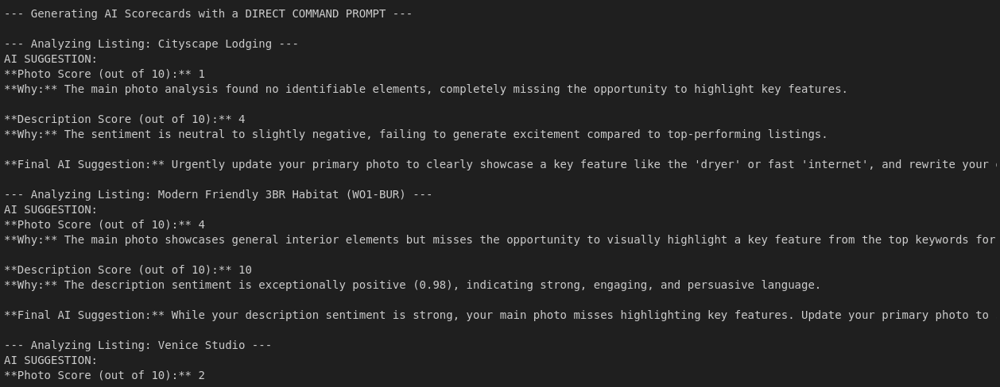

# The Airbnb AI Consultant 🤖

### A Multimodal AI System for the BigQuery AI Hackathon

This repository contains the code and resources for "The Airbnb AI Consultant," a project designed to predict listing success and provide actionable, AI-generated advice for hosts.

---

## 🚀 Overview

Millions of Airbnb hosts rely on guesswork to create their listings. This project introduces a data-driven solution: a multimodal AI system that analyzes a listing's text, photos, and core data to provide a complete "AI Scorecard."

*   **Predictive Modeling:** A classification model predicts if a listing will achieve "Top Tier" status (4.9+ rating).
*   **Insight Generation:** The model reveals the "secret formula" by identifying the most important features for success.
*   **Generative AI:** Google's Gemini model synthesizes these insights into human-readable, expert-level advice.

---

## 🛠️ Tech Stack & Key Concepts

*   **Cloud Platform:** Google Cloud Platform (GCP)
*   **Data Storage:** Google Cloud Storage & BigQuery
*   **Core Libraries:** Python, Pandas, Scikit-learn, XGBoost
*   **AI Services:** Google Vision API, Google Generative AI (Gemini)
*   **Key Techniques:** Exploratory Data Analysis (EDA), Multimodal Feature Engineering, Classification Modeling, Feature Importance, Prompt Engineering.

---
## 📊 Dataset

This project uses the [Airbnb Listings Dataset on Kaggle](https://www.kaggle.com/datasets/wafaaalayoubi/los-angeles-airbnb-data-june-2025) as the primary data source.
---
## 📂 Repository Contents

*   `The_Airbnb_AI_Consultant.ipynb`: The main Kaggle notebook containing the full end-to-end code, from data cleaning to the final AI Scorecard generation.
*   `diagrams/`: Contains the project architecture diagram.

---

## 🌟 Key Results & "Secret Formula"

Our analysis revealed that the most important features for a Top Tier listing are not simple numbers like price, but the **keywords in the description** and the **features in the photos**.

The final output is a powerful "AI Scorecard" that provides targeted advice:

---

## 🔗 Project Links

*   **Live Kaggle Notebook:** [Link to your Public Kaggle Notebook]
*   **Video Demo (YouTube):** [Link to your YouTube Video]
*   **Blog Post (Medium):** [Link to your Blog Post]